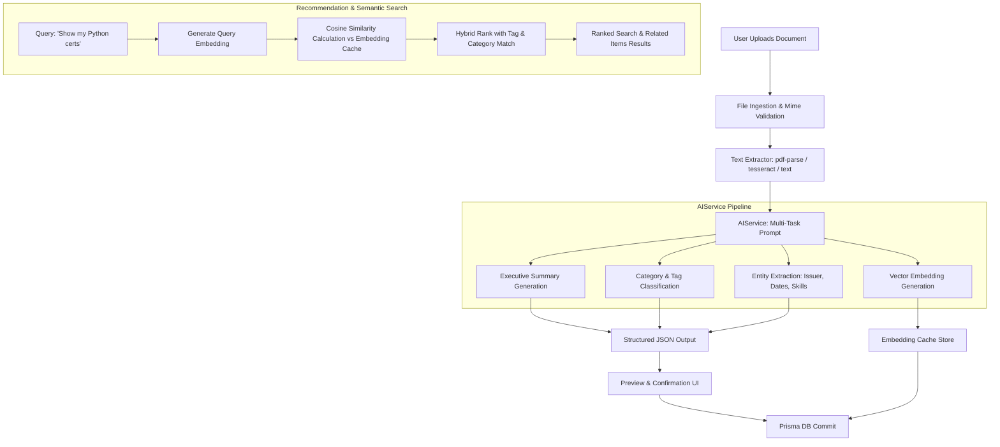

# AI Personal Archive - Comprehensive Development Plan

**Project Name:** AI Personal Archive  
**Architecture:** Full-Stack TypeScript Application (Next.js 15 App Router / Express + React Architecture with Prisma ORM)  
**Date:** August 2026  
**Status:** Planning & Architecture Phase  

---

## 1. Executive Summary & Project Overview

**AI Personal Archive** is an intelligent personal digital repository engineered to store, organize, contextualize, and retrieve personal documents, professional certificates, academic achievements, project portfolios, notes, and records.

### Core Objectives
1. **Complete CRUD Capabilities:** Robust Create, Read, Update, and Delete operations across all archive entities with transactional data integrity.
2. **AI-Powered Intelligence:**
   - **Automatic Categorization:** Intelligent classification into semantic domains (e.g., *Career, Education, Projects, Identity, Finance, Health*).
   - **Entity & Metadata Extraction:** Automatic extraction of issuers, issue dates, expiry dates, skills, project roles, credential IDs, and deliverables.
   - **Document Summarization:** Generation of executive summaries and key bullet takeaways.
   - **Semantic & Natural-Language Search:** Querying personal records using intuitive natural language (e.g., *"Show me all cloud computing certificates earned in 2024 with Python"*).
   - **Graph-like Relationship Discovery:** Cross-linking items based on shared skills, topics, timeframes, and embedding cosine similarity.
3. **Enterprise-Grade Architecture:** Type-safe throughout, clean separation of concerns (Layered Architecture), resilient error handling, responsive UI with premium aesthetics, and dual-mode AI (Cloud LLM with local fallback).

---

## 2. Recommended Technology Stack

| Component | Technology | Rationale |
| :--- | :--- | :--- |
| **Framework** | **Next.js 15 (App Router, TypeScript)** | Unified full-stack framework with React 19, server-side REST API route handlers (`/api/...`), high-performance server components, zero-latency server actions, and seamless asset serving. |
| **Database & ORM** | **Prisma ORM with SQLite** (or MongoDB/PostgreSQL) | Zero-setup, self-contained local database file requiring no external server/daemon installation on Windows. Fully schema-driven with TypeScript types, and instantly migrateable to PostgreSQL/MongoDB Atlas via a single `.env` connection string change. |
| **Authentication** | **Custom JWT + bcryptjs & Session Cookies** | Secure, stateless authentication with password hashing, token validation middleware, and a pre-configured **One-Click Demo Account** for instant evaluation. |
| **Styling & Design System** | **Tailwind CSS + Custom Modern Design Tokens** | Premium dark/light themes, glassmorphism, accent glows, micro-interactions, responsive grid/flex layouts, and Lucide React icons. |
| **File Processing** | **`pdf-parse`, `mammoth`, Native Text Extractors** | Multi-format parsing (PDF, DOCX, TXT, MD, Images) to feed clean text directly to the AI pipeline. |
| **AI & Embeddings** | **Google Gemini 1.5/2.0 Flash SDK + OpenAI SDK & Fallback Heuristic Engine** | Ultra-fast extraction and structured JSON output. Includes an intelligent offline mock/heuristic engine so the system functions perfectly even without an API key. |
| **Validation & State** | **Zod + React Hook Form + SWR / TanStack Query** | Strict runtime schema validation on both client and server API boundaries. |

---

## 3. Database Schema & Entity Relationships

### 3.1 Entity Relationship Diagram (Mermaid)

```mermaid
erDiagram
    USER ||--o{ ARCHIVE_ITEM : "owns"
    USER ||--o{ CATEGORY : "creates"
    USER ||--o{ TAG : "creates"
    USER ||--o{ ACTIVITY_LOG : "generates"
    
    ARCHIVE_ITEM ||--o{ ITEM_TAG : "has"
    TAG ||--o{ ITEM_TAG : "assigned to"
    
    CATEGORY ||--o{ ARCHIVE_ITEM : "categorizes"
    
    ARCHIVE_ITEM ||--o| CERTIFICATE_META : "has specialized data"
    ARCHIVE_ITEM ||--o| PROJECT_META : "has specialized data"
    ARCHIVE_ITEM ||--o| ACHIEVEMENT_META : "has specialized data"
    ARCHIVE_ITEM ||--o| NOTE_META : "has specialized data"
    
    ARCHIVE_ITEM ||--o| EMBEDDING_CACHE : "has vector embedding"

    USER {
        string id PK
        string email UK
        string passwordHash
        string fullName
        string avatarUrl
        string aiProvider
        string customApiKey
        datetime createdAt
        datetime updatedAt
    }

    ARCHIVE_ITEM {
        string id PK
        string userId FK
        string categoryId FK
        string title
        string description
        string itemType "DOCUMENT | CERTIFICATE | PROJECT | ACHIEVEMENT | NOTE"
        string fileUrl
        string fileName
        string fileType
        int fileSize
        string rawTextContent
        string aiSummary
        string aiExtractedKeyValues "JSON"
        int importanceLevel "1 to 5"
        boolean isArchived
        boolean isFavorite
        datetime dateOccurred
        datetime createdAt
        datetime updatedAt
    }

    CATEGORY {
        string id PK
        string userId FK
        string name
        string slug
        string color
        string icon
        string description
        boolean isSystemDefault
    }

    TAG {
        string id PK
        string userId FK
        string name
        string color
    }

    ITEM_TAG {
        string itemId FK
        string tagId FK
    }

    CERTIFICATE_META {
        string id PK
        string itemId FK UK
        string issuer
        string credentialId
        string credentialUrl
        datetime issueDate
        datetime expiryDate
        string skills "JSON Array"
        boolean doesExpire
    }

    PROJECT_META {
        string id PK
        string itemId FK UK
        string role
        string repositoryUrl
        string liveDemoUrl
        string techStack "JSON Array"
        string deliverables "JSON Array"
        datetime startDate
        datetime endDate
    }

    ACHIEVEMENT_META {
        string id PK
        string itemId FK UK
        string organization
        string awardRank
        datetime awardDate
        string verificationProofUrl
    }

    NOTE_META {
        string id PK
        string itemId FK UK
        string markdownContent
        string checklist "JSON Array"
    }

    EMBEDDING_CACHE {
        string id PK
        string itemId FK UK
        string vectorData "JSON Float Array"
        string modelVersion
        datetime updatedAt
    }

    ACTIVITY_LOG {
        string id PK
        string userId FK
        string action "CREATED | UPDATED | DELETED | AI_ANALYSIS | SEARCHED"
        string entityType
        string entityId
        string details
        datetime timestamp
    }
```

---

## 4. Application Architecture & Data Flow

### 4.1 Layered Architecture

```
┌─────────────────────────────────────────────────────────────┐
│                    Presentation Layer                       │
│  React 19 / Next.js Client Components, UI Tokens & Icons    │
│  (Dashboard, Archive Grid, Ingestion Studio, Search Bar)    │
└──────────────────────────────┬──────────────────────────────┘
                               │ HTTP / JSON
┌──────────────────────────────▼──────────────────────────────┐
│                    API Routing & Middleware                 │
│  Next.js App Router API Routes (/api/items, /api/ai, etc.)  │
│  JWT Authentication, Input Validation (Zod), Multer/Uploads │
└──────────────────────────────┬──────────────────────────────┘
                               │
┌──────────────────────────────▼──────────────────────────────┐
│                    Business Logic Layer                     │
│  ┌────────────────────┐  ┌───────────────────────────────┐  │
│  │ ArchiveService     │  │ AIService (Gemini / OpenAI)   │  │
│  │ - CRUD Controller  │  │ - Summarizer & Categorizer    │  │
│  │ - Filtering Engine │  │ - Entity Extractor            │  │
│  │ - Stats Aggregator │  │ - Semantic Search & Vectors   │  │
│  └────────────────────┘  └───────────────────────────────┘  │
│  ┌────────────────────┐  ┌───────────────────────────────┐  │
│  │ FileStorageService │  │ RecommendationEngine         │  │
│  │ - Upload sanitize  │  │ - Cosine Similarity Ranker    │  │
│  │ - Text Extraction  │  │ - Cross-Skill Graph Linking   │  │
│  └────────────────────┘  └───────────────────────────────┘  │
└──────────────────────────────┬──────────────────────────────┘
                               │
┌──────────────────────────────▼──────────────────────────────┐
│                    Data Access Layer                        │
│  Prisma ORM Client & Local Filesystem (/public/uploads)     │
│  SQLite Database (or PostgreSQL / MongoDB Atlas)            │
└─────────────────────────────────────────────────────────────┘
```

---

## 5. Main Pages & Screen Breakdown

1. **Authentication & Onboarding (`/auth/login`, `/auth/register`):**
   - Modern split-screen layout with visual animated archive illustration.
   - Email/password authentication with validation.
   - **"Demo Experience" button:** Instant one-click login pre-populated with realistic sample data (certificates, resume documents, university projects, hackathon achievements, meeting notes).

2. **Executive Dashboard (`/dashboard`):**
   - **Statistics Cards:** Total Items, Storage Used, Category Distribution, AI Insights Count, Top Skills Graph.
   - **Recent Uploads & Activity Stream:** Quick preview of recently indexed items with AI status indicators.
   - **Quick Action Bar:** Drag-and-drop dropzone, quick note creation, semantic search prompt.
   - **Category & Type Badges:** Visual breakdown by Documents, Certificates, Projects, Achievements, Notes.

3. **Archive Explorer (`/archive`):**
   - Dual view modes: **Interactive Grid Cards** and **Dense Tabular List**.
   - **Faceted Filters:** Type filter tabs, Category multi-select, Tag cloud, Date range, Importance rating.
   - **Bulk Actions:** Multi-select items for batch categorization, tag assignment, or deletion.
   - Sorting: Date added, date occurred, alphabetical, importance, or AI relevance.

4. **Upload & Ingestion Studio (`/archive/upload`):**
   - Multi-file drag & drop zone with support for PDF, DOCX, PNG, JPG, TXT, MD.
   - Real-time pipeline visualizer: *1. Uploading -> 2. Extracting Text -> 3. AI Analysis -> 4. Review & Confirm*.
   - Editable AI-suggested fields: Title, Category, Tags, Summary, and specialized metadata before final save.

5. **Item Detail & Intelligence View (`/archive/[id]`):**
   - Embedded file previewer (PDF viewer, Image modal, Markdown renderer).
   - **AI Summary Card:** Key takeaways, bullet points, and sentiment/importance.
   - **Extracted Metadata Panel:** Issuers, Skills, Dates, Tech Stack, Links.
   - **Related Items Section:** Contextually recommended items with similarity score badges.
   - **Action Bar:** Edit, Download, Regenerate AI Summary, Add Tags, Delete.

6. **Projects Portfolio Hub (`/projects`):**
   - Specialized view showcasing software & academic projects with GitHub/Live links, tech stack chips, and deliverables.

7. **Certificates & Credentials Vault (`/certificates`):**
   - Digital credential wall with issuer badges, expiry alerts, and associated skills.

8. **Achievements & Honors (`/achievements`):**
   - Timeline view of competitions, hackathons, awards, and milestones.

9. **Smart Markdown Notes (`/notes`):**
   - Full-featured Markdown editor with auto-save, AI summary generation, and auto-tagging.

10. **Natural Language / Semantic Search Center (`/search`):**
    - Conversational & semantic query bar with natural language interpretations.
    - AI-generated answer synthesis with citations linking directly to stored documents.

11. **Settings & AI Configuration (`/settings`):**
    - Configure Gemini / OpenAI API Keys.
    - Export complete archive as JSON archive or ZIP backup.
    - Reset / Seed sample data.

---

## 6. REST API Endpoint Specification

### Authentication
- `POST /api/auth/register` - Create new user account.
- `POST /api/auth/login` - Authenticate user & return JWT token.
- `POST /api/auth/demo` - Login as instant demo user with sample data.
- `GET  /api/auth/me` - Get current authenticated user profile.
- `POST /api/auth/logout` - Clear authentication session.

### Archive Items (Full CRUD)
- `GET    /api/items` - List items (supports pagination, search, category, type, tag, sort filters).
- `POST   /api/items` - Create new archive item with optional file upload & metadata.
- `GET    /api/items/[id]` - Get full item details including AI summary and specialized metadata.
- `PUT    /api/items/[id]` - Update title, description, category, tags, and metadata fields.
- `DELETE /api/items/[id]` - Delete an archive item and remove associated files.
- `GET    /api/items/[id]/related` - Get AI-recommended related items.

### Specialized Types (Sub-CRUD)
- `GET/POST /api/projects` - Project-specific CRUD.
- `GET/POST /api/certificates` - Certificate-specific CRUD.
- `GET/POST /api/achievements` - Achievement-specific CRUD.
- `GET/POST /api/notes` - Note-specific CRUD.

### Categories & Tags (Full CRUD)
- `GET    /api/categories` - Fetch all user categories with item count metrics.
- `POST   /api/categories` - Create new custom category with color & icon.
- `PUT    /api/categories/[id]` - Update category details.
- `DELETE /api/categories/[id]` - Delete category and reassign/nullify items.
- `GET    /api/tags` - List all unique tags.
- `POST   /api/tags` - Create a tag.
- `DELETE /api/tags/[id]` - Delete a tag.

### AI Operations
- `POST /api/ai/analyze-file` - Upload a temporary file or text to run extraction, summarization, and categorization.
- `POST /api/ai/summarize` - Generate/refresh summary for existing item.
- `POST /api/ai/extract` - Extract specialized key-value pairs (skills, issuer, dates).
- `POST /api/ai/semantic-search` - Perform vector similarity and natural language query.
- `POST /api/ai/ask-archive` - Chat/Q&A over all personal documents.

### Analytics & System
- `GET /api/analytics/overview` - Dashboard statistics, storage breakdown, skill matrix.
- `POST /api/system/seed` - Populate workspace with realistic demo data.

---

## 7. AI Integration & Recommendation Engine



### Fallback Engine (Zero-API-Key Mode)
If no external AI API key is configured by the user, the app seamlessly uses an internal heuristic intelligence engine:
- Rule-based keyword extraction for skills, dates, and organizations.
- NLP frequency-based summarization (TextRank / extractive summarization).
- Levenshtein & TF-IDF vector approximations for semantic search and related items.
- Full notification to the user that they can plug in a Gemini or OpenAI API key in Settings for high-fidelity LLM analysis.

---

## 8. Folder Structure

```
c:\Users\smart\Documents\MERN\
├── prisma/
│   ├── schema.prisma            # Prisma schema (SQLite / Postgres)
│   └── seed.ts                  # Rich demo dataset seeder
├── public/
│   ├── uploads/                 # Safe local file storage
│   └── assets/                  # Icons, illustrations, branding
├── src/
│   ├── app/                     # Next.js App Router
│   │   ├── (auth)/
│   │   │   ├── login/page.tsx
│   │   │   └── register/page.tsx
│   │   ├── (dashboard)/
│   │   │   ├── layout.tsx       # Sidebar, Topbar, Search modal
│   │   │   ├── dashboard/page.tsx
│   │   │   ├── archive/
│   │   │   │   ├── page.tsx     # Explorer & filter view
│   │   │   │   ├── [id]/page.tsx# Detail view
│   │   │   │   └── upload/page.tsx
│   │   │   ├── certificates/page.tsx
│   │   │   ├── projects/page.tsx
│   │   │   ├── achievements/page.tsx
│   │   │   ├── notes/page.tsx
│   │   │   ├── search/page.tsx
│   │   │   └── settings/page.tsx
│   │   └── api/                 # REST API endpoints
│   │       ├── auth/
│   │       ├── items/
│   │       ├── categories/
│   │       ├── tags/
│   │       ├── ai/
│   │       ├── analytics/
│   │       └── system/
│   ├── components/              # Modular UI Components
│   │   ├── ui/                  # Buttons, Cards, Inputs, Modals, Badges, Tabs
│   │   ├── layout/              # Sidebar, Navigation, UserMenu, Header
│   │   ├── archive/             # ItemCard, ItemTable, FilterBar, DetailModal
│   │   ├── upload/              # Dropzone, ProcessingStep, ExtractionPreview
│   │   ├── ai/                  # AISummaryBox, RelatedItemsList, SmartChat
│   │   └── shared/              # LoadingSkeletons, EmptyState, ConfirmDialog
│   ├── lib/                     # Server & Core Utilities
│   │   ├── prisma.ts            # Prisma client singleton
│   │   ├── auth.ts              # JWT & password hashing utils
│   │   ├── file-parser.ts       # PDF, text, and docx extraction
│   │   ├── ai-service.ts        # Gemini/OpenAI integration & prompt engineering
│   │   ├── ai-fallback.ts       # Offline heuristic NLP engine
│   │   ├── vector-search.ts     # Cosine similarity & hybrid ranking
│   │   └── utils.ts             # Date formatters, file size helpers
│   ├── types/                   # TypeScript interfaces & definitions
│   │   └── index.ts
│   └── styles/
│       └── globals.css          # Design system tokens & Tailwind
├── .env.example
├── package.json
├── tsconfig.json
├── tailwind.config.ts
└── DEVELOPMENT_PLAN.md
```

---

## 9. Phased Implementation Plan

| Phase | Description | Deliverables |
| :--- | :--- | :--- |
| **Phase 1: Project Scaffolding & Database Schema** | Initialize Next.js 15 TypeScript project, Tailwind CSS, Prisma ORM, configure SQLite database and define all models & relations. | `package.json`, `prisma/schema.prisma`, DB client, `.env.example`. |
| **Phase 2: Authentication & Core Backend CRUD APIs** | Build auth system (JWT/bcrypt/demo user), file upload handler, and full REST CRUD endpoints for Archive Items, Categories, and Tags. | `/api/auth/*`, `/api/items/*`, `/api/categories/*`, `/api/tags/*`. |
| **Phase 3: AI Engine & Intelligence Pipeline** | Implement text extractors (PDF/text), Gemini/OpenAI SDK service, offline heuristic fallback engine, summarization, entity extraction, and vector similarity calculator. | `src/lib/ai-service.ts`, `src/lib/ai-fallback.ts`, `src/lib/vector-search.ts`, `/api/ai/*`. |
| **Phase 4: Design System & Core Frontend Views** | Build responsive layouts (Sidebar, Header, Theme tokens), Executive Dashboard, Archive Explorer with Grid/List views, and Item Detail modal/page. | Dashboard page, Archive Explorer with dynamic multi-filters and sorting, rich previewers. |
| **Phase 5: Ingestion Studio & Specialized Modules** | Build multi-file drag-and-drop upload studio with real-time AI extraction preview, plus dedicated views for Certificates, Projects, Achievements, and Smart Notes. | Upload flow, Certificates vault, Projects portfolio, Achievements timeline, Markdown notes editor. |
| **Phase 6: Semantic Search, Related Items & Settings** | Implement natural language search interface, related item recommendations widget, settings manager (API key config, sample data seeding, data export). | `/search`, `/settings`, similarity graph components, demo seeder. |
| **Phase 7: End-to-End Verification & Polish** | Validate full CRUD flows, test file uploads, check responsive design across devices, verify error/empty states, and generate comprehensive documentation. | Automated tests/build verification, walkthrough artifact. |

---

## 10. Dependencies & Setup Requirements

```json
{
  "dependencies": {
    "next": "^15.1.0",
    "react": "^19.0.0",
    "react-dom": "^19.0.0",
    "@prisma/client": "^6.0.0",
    "@google/genai": "^0.1.1",
    "openai": "^4.70.0",
    "bcryptjs": "^2.4.3",
    "jsonwebtoken": "^9.0.2",
    "lucide-react": "^0.460.0",
    "clsx": "^2.1.1",
    "tailwind-merge": "^2.5.4",
    "pdf-parse": "^1.1.1",
    "zod": "^3.23.8"
  },
  "devDependencies": {
    "typescript": "^5.6.0",
    "prisma": "^6.0.0",
    "tailwindcss": "^3.4.1",
    "postcss": "^8.4.49",
    "autoprefixer": "^10.4.20",
    "@types/node": "^20.17.0",
    "@types/react": "^19.0.0",
    "@types/bcryptjs": "^2.4.6",
    "@types/jsonwebtoken": "^9.0.7",
    "@types/pdf-parse": "^1.1.4"
  }
}
```
